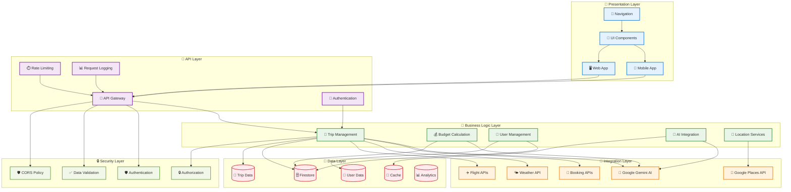
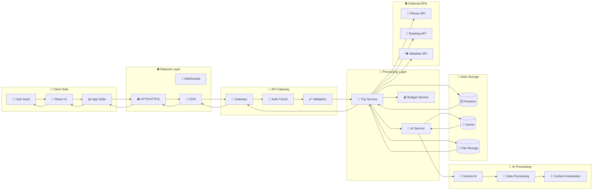

# 🏗️ WanderMind - Architecture Diagram for PPT

## 🎯 Complete System Architecture

### 📊 Visual Architecture Diagram (Mermaid)

```mermaid
graph TB
    subgraph "👤 User Layer"
        U1[🖥️ Desktop Browser]
        U2[📱 Mobile Browser]
        U3[📱 Mobile App]
    end
    
    subgraph "🌐 CDN & Load Balancer"
        CDN[🚀 Vercel CDN]
        LB[⚖️ Load Balancer]
    end
    
    subgraph "🎨 Frontend Layer"
        subgraph "React Application"
            RC[⚛️ React Components]
            RR[🔀 React Router]
            SC[📊 State Management]
            UI[🎨 Tailwind UI]
        end
        
        subgraph "Service Workers"
            SW[🔧 Service Worker]
            CACHE[💾 Cache Storage]
        end
    end
    
    subgraph "🔗 API Gateway"
        AG[🚪 API Gateway]
        AUTH[🔐 Auth Middleware]
        RATE[⏱️ Rate Limiter]
    end
    
    subgraph "🧠 Business Logic Layer"
        subgraph "Core Services"
            TS[🎯 Trip Service]
            BS[💰 Budget Service]
            US[👤 User Service]
            AS[🤖 AI Service]
        end
        
        subgraph "Utility Services"
            VS[✅ Validation Service]
            NS[📧 Notification Service]
            LS[📍 Location Service]
        end
    end
    
    subgraph "🤖 AI & ML Layer"
        subgraph "Google AI Services"
            GEMINI[🧠 Gemini AI]
            NLP[📝 Natural Language Processing]
            ML[🎯 ML Recommendations]
        end
        
        subgraph "AI Processing"
            IP[🔄 Itinerary Processor]
            BP[💰 Budget Predictor]
            RP[⭐ Recommendation Engine]
        end
    end
    
    subgraph "🌐 External APIs"
        subgraph "Google Services"
            PLACES[📍 Google Places API]
            MAPS[🗺️ Google Maps API]
            GEOCODE[🌍 Geocoding API]
        end
        
        subgraph "Travel APIs"
            BOOKING[🏨 EaseMyTrip API]
            FLIGHT[✈️ Flight APIs]
            HOTEL[🏨 Hotel APIs]
            WEATHER[🌤️ Weather API]
        end
    end
    
    subgraph "🔥 Backend Services"
        subgraph "Firebase Platform"
            FIRESTORE[(🗄️ Firestore Database)]
            FIREAUTH[🔐 Firebase Auth]
            FUNCTIONS[⚡ Cloud Functions]
            STORAGE[📁 Cloud Storage]
        end
        
        subgraph "Database Layer"
            USERS[(👥 Users Collection)]
            TRIPS[(🎯 Trips Collection)]
            PREFS[(⚙️ Preferences Collection)]
            CACHE_DB[(💾 Cache Collection)]
        end
    end
    
    subgraph "📊 Analytics & Monitoring"
        ANALYTICS[📈 Google Analytics]
        MONITORING[🔍 Error Monitoring]
        PERFORMANCE[⚡ Performance Tracking]
        LOGS[📝 Logging Service]
    end
    
    subgraph "🔒 Security Layer"
        SSL[🔒 SSL/TLS]
        CORS[🛡️ CORS Policy]
        CSP[🛡️ Content Security Policy]
        VALIDATION[✅ Input Validation]
    end

    %% User Connections
    U1 --> CDN
    U2 --> CDN
    U3 --> CDN
    
    %% CDN to Frontend
    CDN --> LB
    LB --> RC
    
    %% Frontend Internal
    RC --> RR
    RC --> SC
    RC --> UI
    RC --> SW
    SW --> CACHE
    
    %% Frontend to API Gateway
    RC --> AG
    AG --> AUTH
    AG --> RATE
    
    %% API Gateway to Services
    AUTH --> TS
    AUTH --> BS
    AUTH --> US
    AUTH --> AS
    
    %% Service Dependencies
    TS --> VS
    TS --> LS
    BS --> AS
    US --> NS
    
    %% AI Service Connections
    AS --> GEMINI
    AS --> NLP
    AS --> ML
    GEMINI --> IP
    GEMINI --> BP
    GEMINI --> RP
    
    %% External API Connections
    LS --> PLACES
    LS --> MAPS
    LS --> GEOCODE
    TS --> BOOKING
    TS --> FLIGHT
    TS --> HOTEL
    TS --> WEATHER
    
    %% Backend Connections
    TS --> FIRESTORE
    BS --> FIRESTORE
    US --> FIREAUTH
    AS --> FUNCTIONS
    
    %% Database Collections
    FIRESTORE --> USERS
    FIRESTORE --> TRIPS
    FIRESTORE --> PREFS
    FIRESTORE --> CACHE_DB
    
    %% Analytics Connections
    RC --> ANALYTICS
    RC --> MONITORING
    RC --> PERFORMANCE
    FUNCTIONS --> LOGS
    
    %% Security Layer
    CDN --> SSL
    AG --> CORS
    AG --> CSP
    AG --> VALIDATION

    %% Styling
    classDef userLayer fill:#E3F2FD,stroke:#1976D2,stroke-width:2px
    classDef frontendLayer fill:#F3E5F5,stroke:#7B1FA2,stroke-width:2px
    classDef businessLayer fill:#E8F5E8,stroke:#388E3C,stroke-width:2px
    classDef aiLayer fill:#FFF3E0,stroke:#F57C00,stroke-width:2px
    classDef backendLayer fill:#FFEBEE,stroke:#D32F2F,stroke-width:2px
    classDef externalLayer fill:#F1F8E9,stroke:#689F38,stroke-width:2px
    
    class U1,U2,U3 userLayer
    class RC,RR,SC,UI,SW,CACHE frontendLayer
    class TS,BS,US,AS,VS,NS,LS businessLayer
    class GEMINI,NLP,ML,IP,BP,RP aiLayer
    class FIRESTORE,FIREAUTH,FUNCTIONS,STORAGE,USERS,TRIPS,PREFS,CACHE_DB backendLayer
    class PLACES,MAPS,GEOCODE,BOOKING,FLIGHT,HOTEL,WEATHER externalLayer
```



## 🏛️ Layered Architecture View



## 🔄 Data Flow Architecture



## 🔧 Technology Stack Diagram

```mermaid
graph TB
    subgraph "🎨 Frontend Stack"
        REACT[⚛️ React 18]
        VITE[⚡ Vite]
        TAILWIND[🎨 Tailwind CSS]
        ROUTER[🔀 React Router]
        ICONS[🎯 Lucide Icons]
    end
    
    subgraph "🔗 State Management"
        CONTEXT[📊 React Context]
        HOOKS[🪝 Custom Hooks]
        STORAGE[💾 Local Storage]
    end
    
    subgraph "🤖 AI & ML"
        GEMINI_AI[🧠 Google Gemini]
        NLP[📝 Natural Language]
        RECOMMENDATIONS[⭐ ML Recommendations]
    end
    
    subgraph "🌐 APIs & Services"
        PLACES_API[📍 Google Places]
        MAPS_API[🗺️ Google Maps]
        BOOKING_API[🏨 EaseMyTrip]
        WEATHER_API[🌤️ Weather Service]
    end
    
    subgraph "🔥 Backend Services"
        FIREBASE[🔥 Firebase]
        FIRESTORE[🗄️ Firestore DB]
        AUTH[🔐 Firebase Auth]
        FUNCTIONS[⚡ Cloud Functions]
        HOSTING[🌐 Firebase Hosting]
    end
    
    subgraph "🛠️ Development Tools"
        ESLINT[🔍 ESLint]
        PRETTIER[✨ Prettier]
        TYPESCRIPT[📘 TypeScript]
        GIT[📚 Git]
    end
    
    subgraph "🚀 Deployment"
        VERCEL[🚀 Vercel]
        CI_CD[🔄 CI/CD Pipeline]
        MONITORING[📊 Monitoring]
    end
    
    REACT --> VITE
    REACT --> TAILWIND
    REACT --> ROUTER
    REACT --> ICONS
    
    REACT --> CONTEXT
    CONTEXT --> HOOKS
    HOOKS --> STORAGE
    
    REACT --> GEMINI_AI
    GEMINI_AI --> NLP
    GEMINI_AI --> RECOMMENDATIONS
    
    REACT --> PLACES_API
    REACT --> MAPS_API
    REACT --> BOOKING_API
    REACT --> WEATHER_API
    
    REACT --> FIREBASE
    FIREBASE --> FIRESTORE
    FIREBASE --> AUTH
    FIREBASE --> FUNCTIONS
    FIREBASE --> HOSTING
    
    VITE --> ESLINT
    VITE --> PRETTIER
    VITE --> TYPESCRIPT
    VITE --> GIT
    
    VITE --> VERCEL
    VERCEL --> CI_CD
    VERCEL --> MONITORING
```



## 📊 ASCII Architecture Diagram (For Direct PPT Use)

```
                    🌟 WanderMind System Architecture
    
    ┌─────────────────────────────────────────────────────────────────────────┐
    │                          👤 USER LAYER                                  │
    │  ┌─────────────┐  ┌─────────────┐  ┌─────────────┐                     │
    │  │ 🖥️ Desktop   │  │ 📱 Mobile    │  │ 📱 Mobile    │                     │
    │  │   Browser   │  │   Browser   │  │    App      │                     │
    │  └─────────────┘  └─────────────┘  └─────────────┘                     │
    └─────────────────────────────────────────────────────────────────────────┘
                                    │
                                    ▼
    ┌─────────────────────────────────────────────────────────────────────────┐
    │                      🌐 CDN & LOAD BALANCER                             │
    │              ┌─────────────┐    ┌─────────────┐                        │
    │              │ 🚀 Vercel   │    │ ⚖️ Load      │                        │
    │              │    CDN      │    │  Balancer   │                        │
    │              └─────────────┘    └─────────────┘                        │
    └─────────────────────────────────────────────────────────────────────────┘
                                    │
                                    ▼
    ┌─────────────────────────────────────────────────────────────────────────┐
    │                        🎨 FRONTEND LAYER                                │
    │  ┌─────────────┐  ┌─────────────┐  ┌─────────────┐  ┌─────────────┐    │
    │  │ ⚛️ React     │  │ 🔀 Router   │  │ 📊 State    │  │ 🎨 Tailwind │    │
    │  │ Components  │  │ Navigation  │  │ Management  │  │    CSS      │    │
    │  └─────────────┘  └─────────────┘  └─────────────┘  └─────────────┘    │
    └─────────────────────────────────────────────────────────────────────────┘
                                    │
                                    ▼
    ┌─────────────────────────────────────────────────────────────────────────┐
    │                        🔗 API GATEWAY                                   │
    │  ┌─────────────┐  ┌─────────────┐  ┌─────────────┐                     │
    │  │ 🚪 Gateway   │  │ 🔐 Auth     │  │ ⏱️ Rate      │                     │
    │  │   Router    │  │ Middleware  │  │  Limiter    │                     │
    │  └─────────────┘  └─────────────┘  └─────────────┘                     │
    └─────────────────────────────────────────────────────────────────────────┘
                                    │
                                    ▼
    ┌─────────────────────────────────────────────────────────────────────────┐
    │                     🧠 BUSINESS LOGIC LAYER                             │
    │  ┌─────────────┐  ┌─────────────┐  ┌─────────────┐  ┌─────────────┐    │
    │  │ 🎯 Trip     │  │ 💰 Budget   │  │ 👤 User     │  │ 🤖 AI       │    │
    │  │  Service    │  │  Service    │  │  Service    │  │  Service    │    │
    │  └─────────────┘  └─────────────┘  └─────────────┘  └─────────────┘    │
    └─────────────────────────────────────────────────────────────────────────┘
                                    │
                    ┌───────────────┼───────────────┐
                    ▼               ▼               ▼
    ┌─────────────────────┐ ┌─────────────────────┐ ┌─────────────────────┐
    │    🤖 AI LAYER      │ │  🌐 EXTERNAL APIs   │ │  🔥 BACKEND LAYER   │
    │ ┌─────────────────┐ │ │ ┌─────────────────┐ │ │ ┌─────────────────┐ │
    │ │ 🧠 Gemini AI    │ │ │ │ 📍 Google       │ │ │ │ 🗄️ Firestore    │ │
    │ │ 📝 NLP Engine   │ │ │ │   Places API    │ │ │ │ 🔐 Firebase     │ │
    │ │ ⭐ ML Recommend │ │ │ │ 🏨 Booking APIs │ │ │ │   Auth          │ │
    │ │ 💰 Budget AI    │ │ │ │ 🌤️ Weather API  │ │ │ │ ⚡ Cloud        │ │
    │ └─────────────────┘ │ │ └─────────────────┘ │ │ │   Functions     │ │
    └─────────────────────┘ └─────────────────────┘ │ └─────────────────┘ │
                                                    └─────────────────────┘
                                    │
                                    ▼
    ┌─────────────────────────────────────────────────────────────────────────┐
    │                      💾 DATA STORAGE LAYER                              │
    │  ┌─────────────┐  ┌─────────────┐  ┌─────────────┐  ┌─────────────┐    │
    │  │ 👥 Users    │  │ 🎯 Trips    │  │ ⚙️ Prefs    │  │ 💾 Cache    │    │
    │  │ Collection  │  │ Collection  │  │ Collection  │  │ Collection  │    │
    │  └─────────────┘  └─────────────┘  └─────────────┘  └─────────────┘    │
    └─────────────────────────────────────────────────────────────────────────┘
                                    │
                                    ▼
    ┌─────────────────────────────────────────────────────────────────────────┐
    │                    📊 ANALYTICS & MONITORING                            │
    │  ┌─────────────┐  ┌─────────────┐  ┌─────────────┐  ┌─────────────┐    │
    │  │ 📈 Google   │  │ 🔍 Error    │  │ ⚡ Performance│  │ 📝 Logging  │    │
    │  │ Analytics   │  │ Monitoring  │  │ Tracking    │  │ Service     │    │
    │  └─────────────┘  └─────────────┘  └─────────────┘  └─────────────┘    │
    └─────────────────────────────────────────────────────────────────────────┘
```

## 🎯 How to Create Architecture Image for PPT:

### Method 1: Mermaid to Image
1. **Copy Mermaid code** from above
2. **Go to**: https://mermaid.live/
3. **Paste code** and customize colors
4. **Export as PNG/SVG** (high resolution)
5. **Insert into PPT**

### Method 2: Draw.io/Lucidchart
1. **Use ASCII diagram** as reference
2. **Create visual version** with proper icons
3. **Apply consistent color scheme**
4. **Export as high-res image**

### Method 3: PowerPoint Native
1. **Use ASCII version** directly in PPT
2. **Apply monospace font** (Courier New)
3. **Add colors** to different layers
4. **Use shapes** for better visual appeal

### Recommended Colors:
- **User Layer**: Light Blue (#E3F2FD)
- **Frontend**: Purple (#F3E5F5)
- **Business Logic**: Green (#E8F5E8)
- **AI Layer**: Orange (#FFF3E0)
- **Backend**: Red (#FFEBEE)
- **External APIs**: Light Green (#F1F8E9)

This architecture diagram clearly shows WanderMind's scalable, modern architecture with proper separation of concerns and integration points!