# 🌟 WanderMind - Diagrams for PPT Presentation

## 1. 📊 Process Flow Diagram - User Journey

```mermaid
flowchart TD
    A[👤 User Lands on Homepage] --> B{🔐 Authenticated?}
    B -->|No| C[📝 Sign Up/Login]
    B -->|Yes| D[🎯 Create New Trip]
    C --> D
    
    D --> E[📍 Enter Destination]
    E --> F[📅 Select Dates & Travelers]
    F --> G[💰 Set Budget & Preferences]
    G --> H[🤖 AI Processes Request]
    
    H --> I[⚡ Generate Trip Options]
    I --> J[🏨 Display 4 Hotels]
    I --> K[🚗 Display 3 Transports]
    I --> L[✈️ Display 3 Flights]
    I --> M[🎯 Display 3 Activities/Day]
    
    J --> N{👍 User Satisfied?}
    K --> N
    L --> N
    M --> N
    
    N -->|No| O[🔄 Regenerate Options]
    N -->|Yes| P[💾 Save Trip]
    O --> I
    
    P --> Q[📱 View in My Trips]
    Q --> R[📤 Share with Others]
    Q --> S[✏️ Edit Trip Details]
    Q --> T[🔗 Book Services]
```

## 2. 🎭 Use Case Diagram

```mermaid
graph TB
    subgraph "WanderMind System"
        UC1[Create Trip]
        UC2[View Trip Details]
        UC3[Manage Trips]
        UC4[Get Budget Prediction]
        UC5[Search Destinations]
        UC6[Share Trip]
        UC7[Book Services]
        UC8[Authenticate User]
        UC9[Generate AI Recommendations]
        UC10[Compare Options]
    end
    
    subgraph "Actors"
        User[👤 Traveler]
        Admin[👨‍💼 Admin]
        AI[🤖 AI System]
        BookingAPI[🔗 Booking APIs]
    end
    
    User --> UC1
    User --> UC2
    User --> UC3
    User --> UC4
    User --> UC5
    User --> UC6
    User --> UC7
    User --> UC8
    User --> UC10
    
    Admin --> UC8
    Admin --> UC9
    
    AI --> UC9
    AI --> UC4
    
    BookingAPI --> UC7
    
    UC1 --> UC9
    UC1 --> UC4
    UC2 --> UC10
    UC3 --> UC2
    UC6 --> UC2
```

## 3. 🏗️ System Architecture Diagram

```mermaid
graph TB
    subgraph "Frontend Layer"
        UI[🎨 React UI Components]
        Router[🔀 React Router]
        State[📊 Context API State]
    end
    
    subgraph "Service Layer"
        Auth[🔐 Auth Service]
        Trip[🎯 Trip Service]
        Budget[💰 Budget Service]
        AI[🤖 AI Service]
    end
    
    subgraph "External APIs"
        Gemini[🧠 Google Gemini AI]
        Places[📍 Google Places API]
        Maps[🗺️ Google Maps API]
        Booking[🔗 EaseMyTrip API]
    end
    
    subgraph "Backend Services"
        Firebase[🔥 Firebase]
        Firestore[(🗄️ Firestore DB)]
        FireAuth[🔐 Firebase Auth]
    end
    
    UI --> Router
    UI --> State
    State --> Auth
    State --> Trip
    State --> Budget
    
    Auth --> FireAuth
    Trip --> AI
    Trip --> Firestore
    Budget --> AI
    
    AI --> Gemini
    Trip --> Places
    Trip --> Maps
    Trip --> Booking
    
    Firebase --> Firestore
    Firebase --> FireAuth
```

## 4. 🔄 Data Flow Diagram

```mermaid
flowchart LR
    subgraph "User Input"
        A[📍 Destination]
        B[📅 Dates]
        C[👥 Travelers]
        D[💰 Budget]
        E[🎨 Preferences]
    end
    
    subgraph "Processing"
        F[🤖 AI Engine]
        G[💰 Budget Calculator]
        H[📊 Option Generator]
    end
    
    subgraph "Data Sources"
        I[🗺️ Places API]
        J[✈️ Flight Data]
        K[🏨 Hotel Data]
        L[🚗 Transport Data]
    end
    
    subgraph "Output"
        M[🏨 4 Hotels]
        N[🚗 3 Transports]
        O[✈️ 3 Flights]
        P[🎯 Activities]
    end
    
    A --> F
    B --> F
    C --> G
    D --> G
    E --> F
    
    F --> H
    G --> H
    
    I --> H
    J --> H
    K --> H
    L --> H
    
    H --> M
    H --> N
    H --> O
    H --> P
```

## 5. 🎯 Feature Interaction Diagram

```mermaid
graph TD
    subgraph "Core Features"
        A[🧠 AI Trip Generation]
        B[💰 Budget Management]
        C[🏨 Multiple Options]
        D[🎨 UI/UX]
        E[🔐 Authentication]
        F[📱 Trip Management]
    end
    
    A --> B
    A --> C
    B --> C
    C --> D
    E --> F
    F --> A
    D --> E
    
    A -.->|Enhances| D
    B -.->|Influences| A
    C -.->|Requires| B
    F -.->|Stores| C
```

## 6. 🔄 Component Interaction Flow

```mermaid
sequenceDiagram
    participant U as 👤 User
    participant UI as 🎨 Frontend
    participant AS as 🔧 Auth Service
    participant TS as 🎯 Trip Service
    participant AI as 🤖 AI Engine
    participant DB as 🗄️ Database
    
    U->>UI: Enter trip details
    UI->>AS: Verify authentication
    AS-->>UI: Auth confirmed
    
    UI->>TS: Create trip request
    TS->>AI: Generate recommendations
    AI-->>TS: Return options
    
    TS->>DB: Save trip data
    DB-->>TS: Confirm save
    
    TS-->>UI: Return trip with options
    UI-->>U: Display trip results
    
    U->>UI: Select preferences
    UI->>DB: Update trip
    DB-->>UI: Confirm update
```

## 7. 🏛️ Layered Architecture

```mermaid
graph TB
    subgraph "Presentation Layer"
        A[🎨 React Components]
        B[🔀 Routing]
        C[📱 Responsive UI]
    end
    
    subgraph "Business Logic Layer"
        D[🎯 Trip Logic]
        E[💰 Budget Logic]
        F[🔐 Auth Logic]
        G[🤖 AI Integration]
    end
    
    subgraph "Data Access Layer"
        H[🔥 Firebase SDK]
        I[🌐 API Clients]
        J[💾 Local Storage]
    end
    
    subgraph "External Services"
        K[🧠 Google Gemini]
        L[📍 Google Places]
        M[🗄️ Firestore]
        N[🔗 Booking APIs]
    end
    
    A --> D
    B --> E
    C --> F
    A --> G
    
    D --> H
    E --> I
    F --> H
    G --> I
    
    H --> M
    I --> K
    I --> L
    I --> N
    J --> C
```

## 8. 🎨 User Interface Flow

---

## 📋 How to Use These Diagrams in PPT:

### 1. **Copy Mermaid Code**
- Copy any diagram code above
- Paste into online Mermaid editor: https://mermaid.live/
- Export as PNG/SVG

### 2. **Recommended Diagrams for PPT:**
- **Slide 1**: Process Flow Diagram (User Journey)
- **Slide 2**: System Architecture Diagram
- **Slide 3**: Use Case Diagram
- **Slide 4**: Data Flow Diagram

### 3. **Visual Enhancement Tips:**
- Use consistent colors for each actor/component type
- Add icons and emojis for better visual appeal
- Keep text readable at presentation size
- Use animations to show flow progression

### 4. **Alternative Tools:**
- **Draw.io**: Import Mermaid or create custom diagrams
- **Lucidchart**: Professional diagram creation
- **Figma**: Custom illustrations and mockups
- **Canva**: Quick diagram templates

These diagrams provide comprehensive visual representations of WanderMind's functionality, architecture, and user interactions perfect for your presentation!